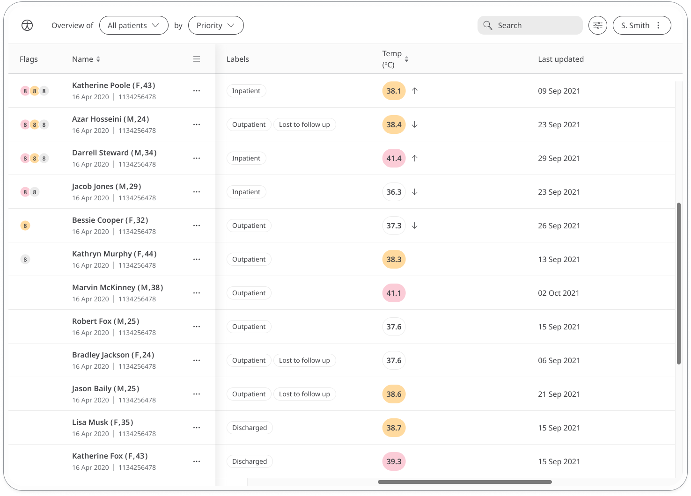

** Body temperature is one of the main vital signs that is monitored to ensure safe and effective care **

As body temperature can reflect on the condition of a person, the Huma Temperature module enables Patients to record their temperature so that Clinicians can review for any indications of various conditions of human health.

## How it works

Patients will measure their Body Temperature using a thermometer, and enter into the Huma App. From there, Clinicians can view new and historic results in the Clinician Portal and be informed on severity.  

### Patients

In the Huma App, Patients can select the Temperature module and by pressing the “Add” button can enter a value as °C, with the time and date automatically added as now, but editable. 

From within the module, Patients can view their progress in a graph and press “Show all data” to view previous results in a table. Patients can also set a daily, weekly, or monthly reminder to help keep on track.

### Clinicians

In the Clinician Portal, on the Patient List, Clinicians can view a table of Patients, from which the Temp column will display the last recorded reading indicated as a Red Amber Green indicator to inform severity. 

Clicking on the Patient row takes the Clinician to the Patient Summary where all vitals can be viewed, by selecting the Blood Glucose module all historic data can be displayed as a graph or a table of results.