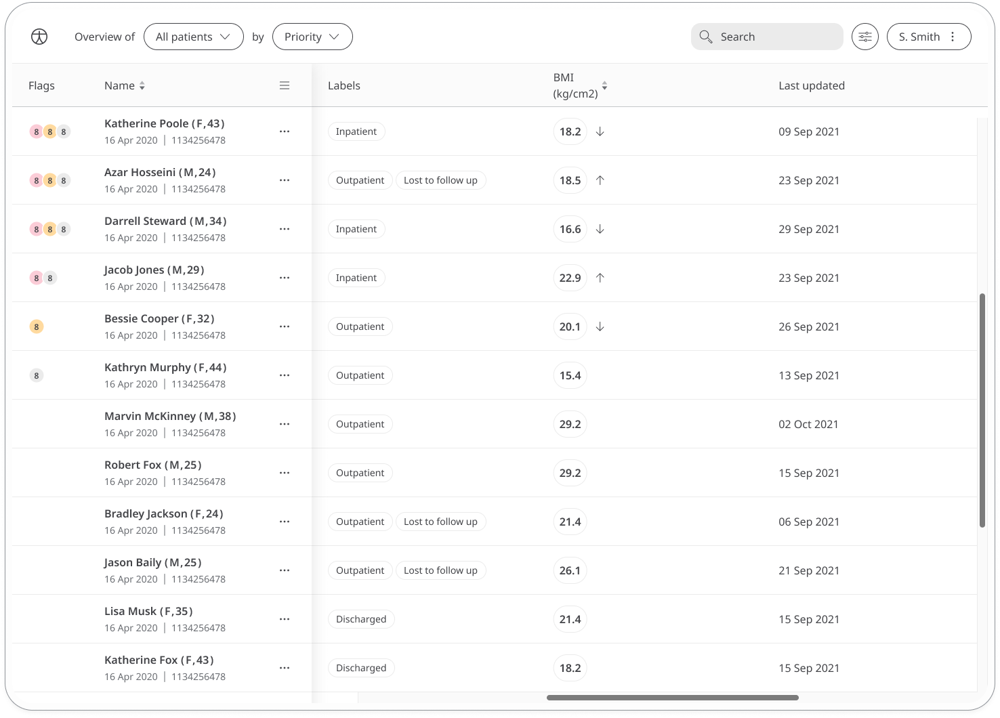

Body Mass Index (BMI) is a measure of whether a patient is a healthy weight for their height. BMI can be an important indicator of risk factors of certain health conditions and can be an important vital to keep track of for some patients.

## How it works

Patients report their height as part of the onboarding process. Then, they open the Weight & BMI module and click **Add** to enter their weight. Huma then uses both data points to calculate their BMI.

In the BMI module, patients can report weight changes and see how this affects their BMI score. The time and date is added automatically at the moment they make the entry (although this can be edited if needed). They can set reminders from within the module to help them stay on track and make sure they don't miss a reading.

Patients can view their BMI evolution presented in a graph. In the Clinician Portal, care teams will be able to easily see the latest BMI entries from their patients and any concerning values will be flagged. 

The Patient Summary displays a more detailed view of the patient's BMI data in graph or table form.

