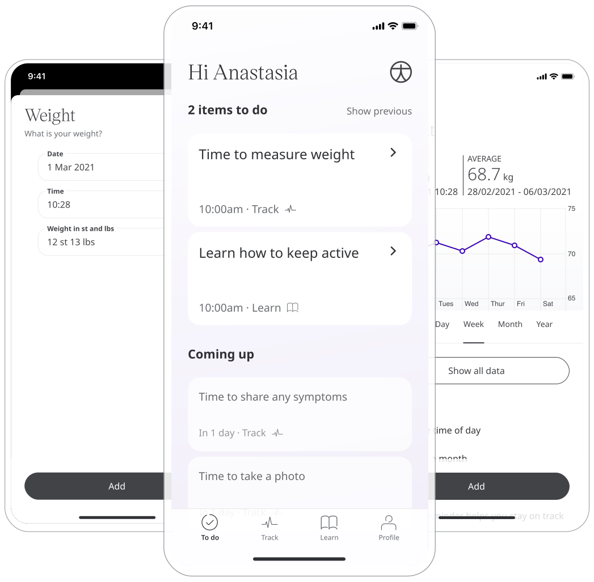
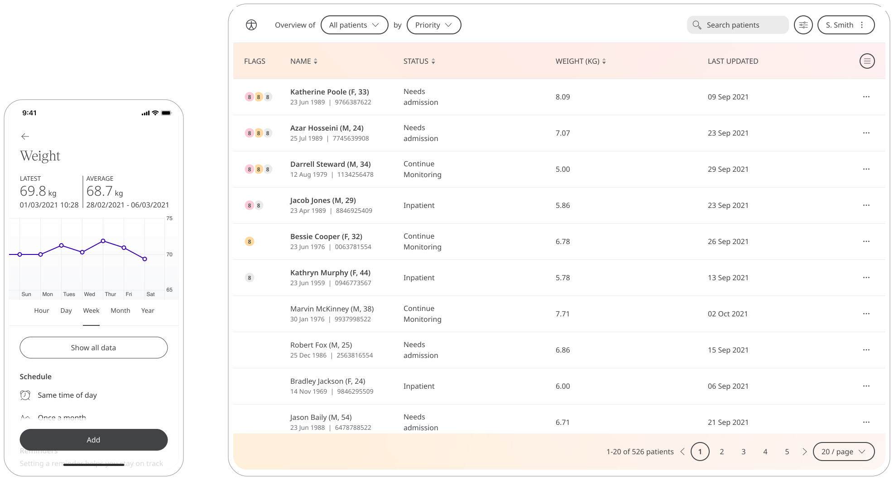

** Helping Patients manage their Weight  **

It is critical to maintaining a healthy weight for good health, as it can lower the risk of many conditions and ailments. With a simple and accessible measurement, the Weight module will inform Care Teams to gather insights and provide feedback if needed.

## How is works

Using a typical bathroom scale, a Patient can weigh themselves and provide the result in the Huma App in kilogram, pounds, or stone dependants on the units preferred.

### Patients

In the Huma App, Patients can select the Weight module and by pressing the “Add” button can enter a value as kilograms (or configured unit), with the time and date automatically added as now, but editable. 

From within the module, Patients can view their progress in a graph and press “Show all data” to view previous results in a table. Patients can also set a daily, weekly, or monthly reminder to help keep on track.

### Clinicians

In the Clinician Portal, on the Patient List, Clinicians can view a table of Patients, from which the Weight column will display the last recorded reading indicated as a Red Amber Green indicator to inform severity. 

Clicking on the Patient row takes the Clinician to the Patient Summary where all vitals can be viewed, by selecting the Heart Rate module all historic data can be displayed as a graph or a table of results.