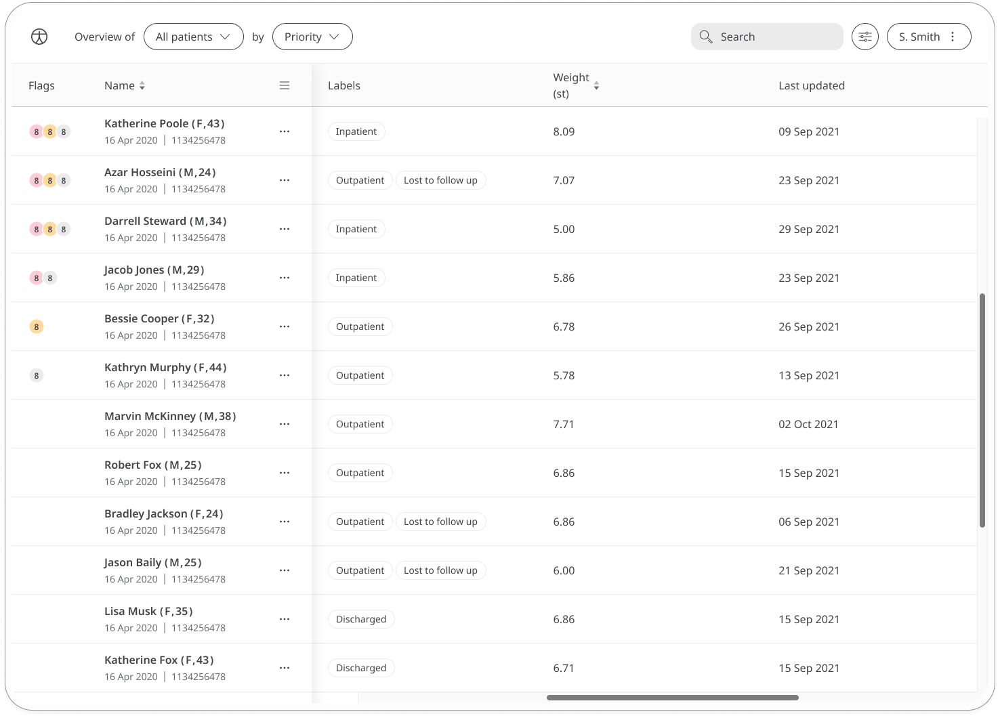

Helping Patients manage their Weight is critical for good health as it can lower the risk of many conditions and ailments. 

## How it works

Using a typical bathroom scale, patients weigh themselves and enter the reading into the Huma App in either kilograms, pounds, or stones and pounds,  depending on the preferred units selected in the Huma App.

The time and date is added automatically at the moment they make the entry (although this can be edited if needed) and patients will also be able to view all their historic readings from within the module. Reminders can be set to help them stay on track and make sure they don't miss an entry.

In the Clinician Portal, care teams will be able to easily see the latest weight entries from their patients.

The Patient Summary displays a more detailed view of the patient's historic readings in graph or table form.

