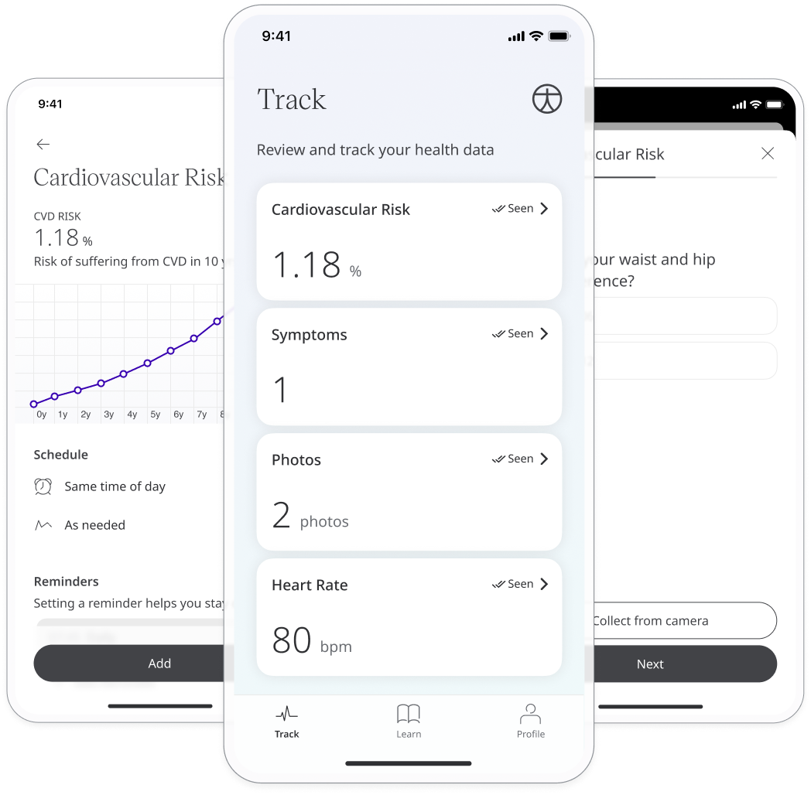

** Evaluating the risk of Cardiovascular Disease **

The CVD Risk Score helps Patients understand the risk of developing cardiovascular disease (CVD) over the next 10 years, an therefore can provide the neccessary advice needed to improve longevity. 

## How it works

The assessment of CVD is achieved through asking the Patients a series of question relating to the lifestyle and the measurement of vitals to extrapolate the risk over the next 10 years.

### Patients

In the Huma App, Patients can select the Cardiovascular Risk module and by pressing the “Add” button will take the Patients step by step to gather the information necessary to calculate the risk score as a percentage risk of suffering from CVD in 10 years.

### Clinicians

This module helps Patients to understand their health and to help with decisions in their lifestyle and therefore the data collected is not viewable from the Clinician Portal. 
