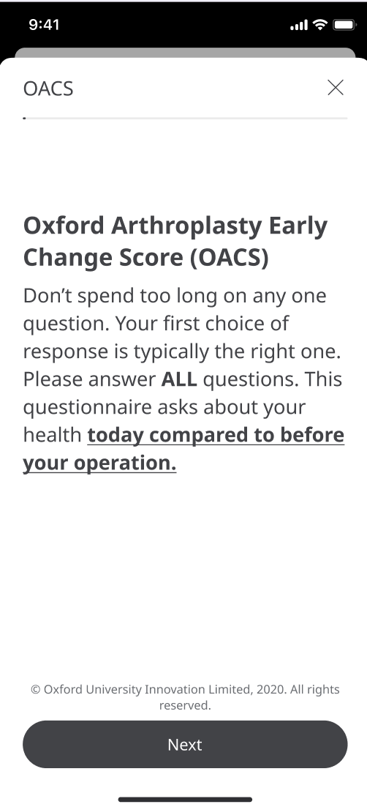
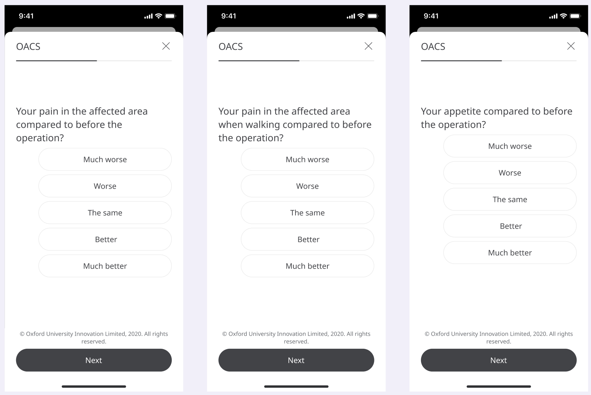

** Giving Surgeons a way to Assess Patients' Recovery Pathway **

Care can take many forms, one of which is post-surgery care for Patients. 
This looks like Surgeons assessing for the improvement in the quality of life of their Patients and advising on any steps to take. Therefore we have to deliver feedback from Patients to their Surgeons in order to help with the delivery of that care.

## How it works

In Huma, we have taken the Oxford Arthroplasty Early Recovery Score (OARS) and used them to ask the Patient in-app about their post-surgery progress. This will give Surgeons the information needed to make decisions that are best for their Patients. 

