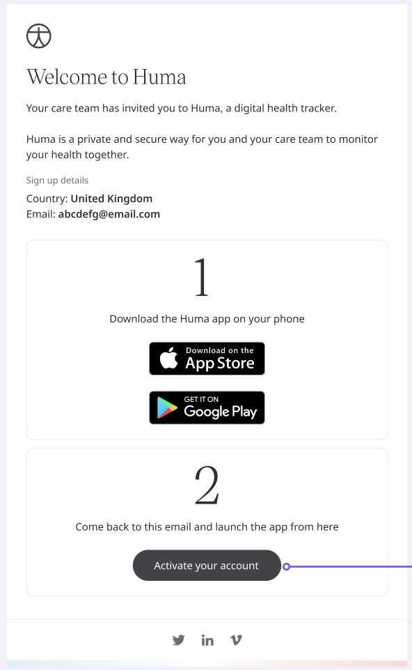

** Bringing in a Patient into the Platform **

As you never get a second chance to make a great first impression, it is important to make sure that in the initial steps of being invited to the platform there is a smooth and easy journey through to onboarding that will catch any irregularities in the expected journey. For example, where the patient has not yet downloaded the app but has had an invite link supplied to them. The expectation is to be able to provide the necessary data for monitoring and go through activation, but they need to know what to download and where. 

## How it works

When someone has been invited to become a new user they need to have the app downloaded to be able to activate their accounts. When the patient goes through the onboarding process without the app, they will be redirected to a landing page where they are one click away from their respective app store so that they can complete their sign up.

