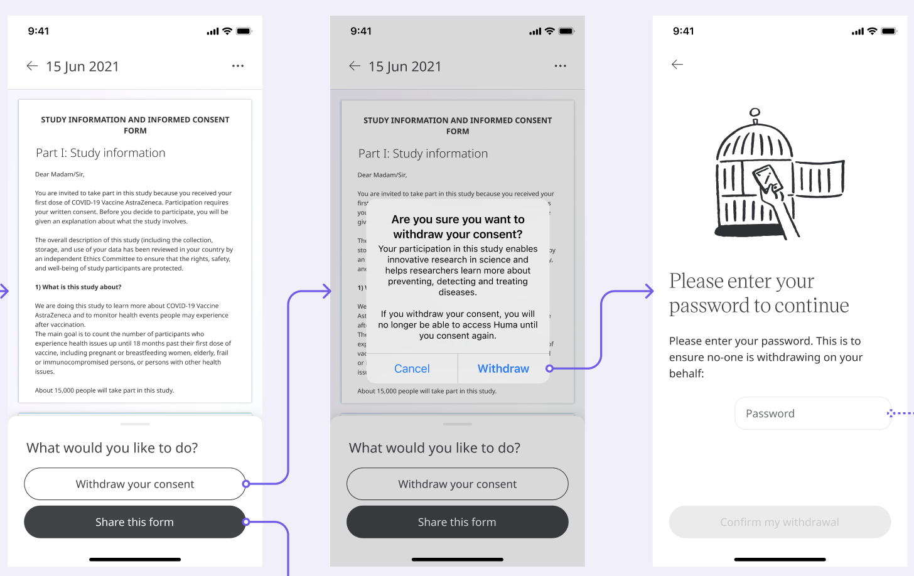

** Patients and Participants Maintaining Control over their Data **

As with any supply of data, consent and processes need to sit with the user and be delivered in a clear way. Participants need to be informed about which data could be shared at all times, so they can opt-out and maintain control over their data. The process and who to contact is unknown and can lead to a lack of confidence and control.

## How it works

Participants can easily withdraw their consent at any time from in the app itself, without having to search for it or contact a customer support representative. This gives control to the Patient when they need it, at any time.

