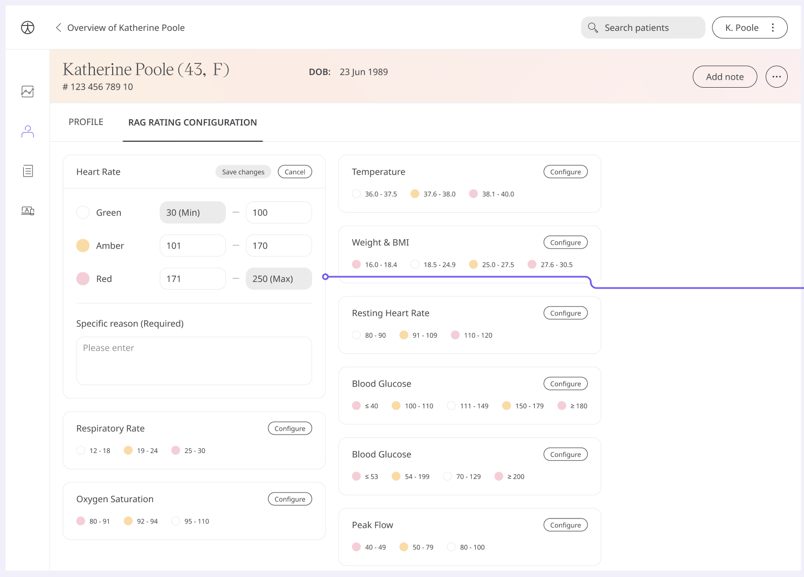

** Shaping the visualisation of the data around the Patient. **

As Patient data is monitored, it needs to be assessed for whether a particular data point is too high, too low, or acceptable. We use default thresholds to create a red, amber, green indication for numbers associated with the Patient.

However, the opinion of the healthcare professional responsible for the Patient needs to supersede that of any made in-app. Their observations and direct care give context and insight on what is the right care and prioritisation.

## How it works

A Clinician can set what they think is appropriate as a threshold for a particular Patient. From the Patient overview screen, you can click “RAG Rating Configuration” and “Configure” on the records and set the values by changing the defaults already in place from onboarding. 

