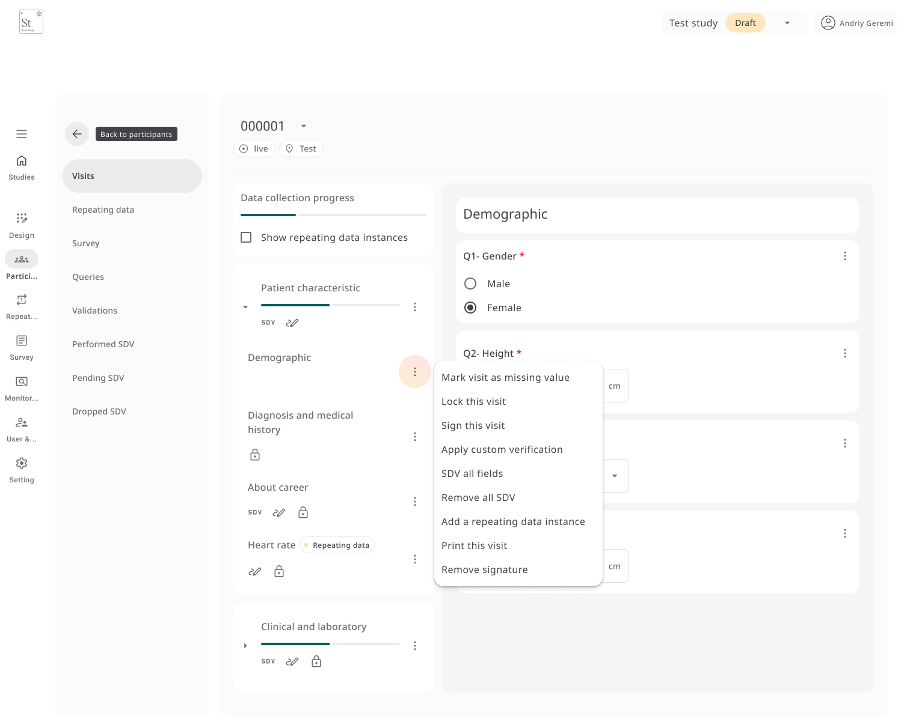
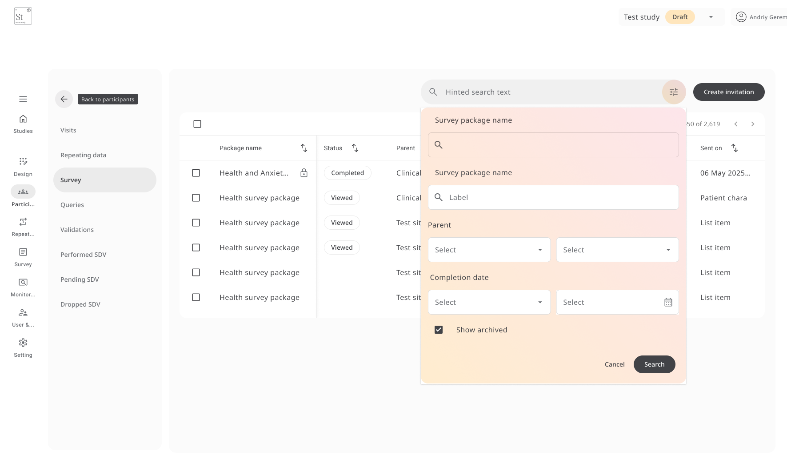

The **Participants** section allows you to manage enrolled subjects across your study.  
From here, you can:

- View progress  
- Complete data entry  
- Track queries  
- Manage repeating data  
- Perform **Source Data Verification (SDV)**

Each participant has a unique **ID** and a **status label** for tracking.

## Adding Participants

You can add participants **manually** or **import them in bulk**:

- **Manual entry**: Click **Add New**, and a new participant ID will be created.
- **Import**: Use the **Import participants** button to upload a list using the platform’s supported format.

Each participant is automatically assigned a unique **ID** (e.g., `000001`) and can be linked to a specific site if your study has multiple locations.

---

## Completing Visits and Forms

To enter or view data:

1. Click on a **participant ID** to open their record.
2. The **visit structure** is shown in the left panel. Click a visit (e.g., *Baseline* or *Follow-up*) to open it.
3. Complete the fields in each form as needed. Use **SDV**, **Sign**, or **Lock** actions when appropriate.

For each visit, you can:

- **Mark the visit as missing** (with reason)
- **Lock the visit** once complete
- **Sign the visit** (which records the action in the audit trail)
- **Apply custom verification** or full **SDV**

At the bottom of each visit entry, icons indicate whether the **SDV**, **Sign**, and **Lock** steps have been completed.

---

## Repeating Data

If a participant has repeating data forms (e.g., *Medication Intake*), you will see them listed under the **visit** or **repeating data** section. You can:

- **Add a new instance** (e.g., another medication entry)
- **Edit**, **Delete**, or **Sign** individual instances
- Track progress by status: *Not started*, *In progress*, or *Completed*

Each entry is **timestamped** and displayed under its parent visit or repeating data group.

---

## Surveys
For surveys assigned to a participant:

- The **status** (e.g., *Viewed*, *Completed*) is displayed in the participant list.
- You can **resend invitations** or **preview responses**.
- Survey status **updates in real time** once a participant engages with it.
- You can also **filter** and **resend surveys** directly from the participant dashboard.

---

## Queries and Validation

**Queries** allow reviewers to flag data that needs clarification or correction.

To raise a query:

1. Click a field and choose **Add query**.
2. Add a remark and select the query status:
   - **New**
   - **Open**
   - **Resolved**
   - **Closed**

The full comment history is stored with **timestamps** and **usernames**.

Validation issues (e.g., unmet logic rules or failed constraints) are also **highlighted automatically** and can be reviewed or corrected inline.

---

## Source Data Verification (SDV)

**SDV tools** are built into the participant workflow to ensure accuracy and audit compliance.

- **Performed SDV** – Apply SDV on individual fields or entire forms
- **Pending SDV** – View outstanding verifications that require follow-up
- **Dropped SDV** – Mark forms or visits as excluded from SDV, with justification

All SDV actions are **recorded in the audit log** and can be undone if needed.

You can also:

- Use **SDV all fields** to verify an entire visit at once
- Use **Remove SDV** to undo verification
- Apply **custom verification rules** if enabled in your study settings

---

## Updating Participant Status

Each participant can be assigned a custom **status label** (e.g., *Enrolled*, *Completed*, *Failed*).

To update a participant’s status:

1. Click **Update status** under the participant ID.
2. Choose from the predefined labels or create a new one.
3. The selected label will appear in the **participant list** and can be updated at any time.