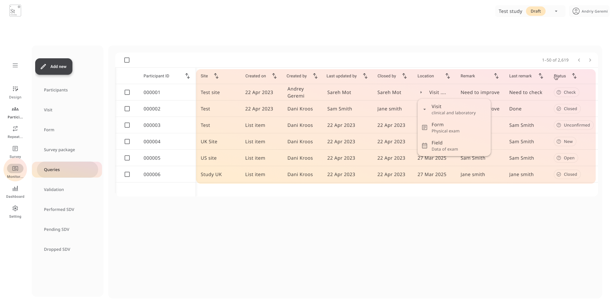

# Monitoring

The **Monitoring** section provides a centralized workspace for study monitors, data managers, and reviewers to track data quality, resolve discrepancies, and verify records across all participants.  
From here, you can view **participant status**, **SDV progress**, **open queries**, **validation issues**, and **form-level completeness**, all in one place.

---

## Monitoring Views

You can toggle between different monitoring views depending on your task:

- **Participants**  
  Overview of all enrolled participants, their associated site, and the status of their forms, surveys, and visits.  
  Columns include: participant ID, lock status, query flags, signature status, and last update.

- **Visit View**  
  See each participant’s visit status at a glance, including completion, signature, SDV, and lock state.

- **Form View**  
  Drill down into individual forms. Use this view to monitor form-specific SDV or pending entries.

- **Survey View**  
  Displays the status of all survey packages assigned to participants, including delivery method, last opened date, and completion status.

---

## Queries

Monitor and respond to data queries from any form field:

- View **query history** per field, with full audit trails of remarks and status changes.
- View **query status**: *New*, *Open*, *Unconfirmed*, *Resolved*, *Closed*
- **Update status** and **add remarks** directly within the monitoring panel

---

## Validations

This view highlights any data entries that fail built-in validation rules.  
Each validation issue includes:

- Participant and form reference
- Field name and value
- Operator and date
- Suggested fix or rule logic

Use this view to identify **systematic data entry errors** or **protocol violations**.

---

## Source Data Verification (SDV)

Three tabs support tracking SDV workflows:

- **Performed SDV**  
  Fields, forms, or visits that have been verified.  
  Each record includes timestamp, operator, and audit history.

- **Pending SDV**  
  View outstanding SDV tasks at the field, form, or participant level.  
  These can be filtered by site or status.

- **Dropped SDV**  
  Shows fields or visits intentionally excluded from verification, with justification.

Each SDV action is **logged** and can be **reversed** if needed, maintaining full audit integrity.

---

##  Filtering and Export

Use **search and filters** to quickly locate specific records or patterns:

- Filter by **site**, **visit**, or **participant ID**
- Sort by **SDV status**, **query count**, or **signature**
- **Export monitoring logs** for offline review or audit preparation

> 💡 **Best Practice Tip:**  
> Use this section as your **daily operational checkpoint**.  
> It helps identify data collection gaps, streamline verification workflows, and maintain protocol compliance across all active participants.
