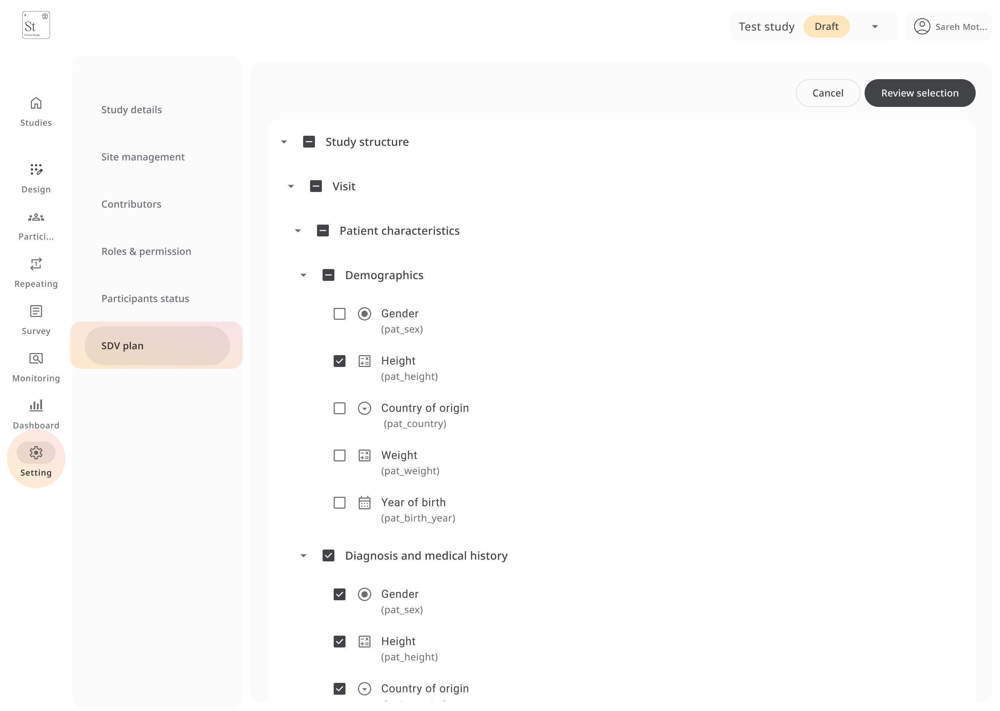

# SDV Plan

The **SDV Plan** allows you to define exactly which fields in your study require **Source Data Verification (SDV)**. This ensures data is reviewed against the original source documents for accuracy and compliance.

Any field selected here will appear as *SDV required* when managing participants or during monitoring, helping site monitors focus on the most critical data points.

---

## Setting Up an SDV Plan

1. Go to **Settings** in the left navigation.
2. Select **SDV Plan** from the menu.
3. Expand the study structure to see:
   - Visits  
   - Forms within visits  
   - Sections and fields within forms
4. Tick the checkbox next to each field you want to include in your SDV plan.
   - A checkmark means this field will require SDV.
   - You can select entire sections or individual fields.
5. Click **Review selection** to confirm your choices.
6. Save the plan.

---

## How It Works

- Any field included in the SDV plan will be flagged as *SDV required* in **Participants** and **Monitoring**.
- Monitors can then mark those fields as **SDV completed**, **Pending**, or **Dropped**.
- If data in a verified field changes, the SDV status will reset and require re-verification.

---

## Best Practice Tip

Limit your SDV plan to **critical data points** (e.g., primary outcomes, safety data) to reduce unnecessary workload while maintaining data quality.
