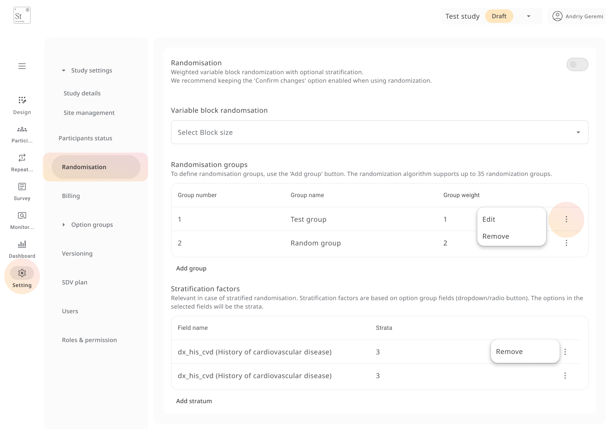

# Study Settings

From the **Settings** tab, you can manage the following:

- **Study Details**
  - Study name, Study ID, and Trial Registry ID
  - Main contact email
  - Study type: *Production*, *Test*, or *Example*
  - Site status: *Live* or *Not Live*
  - Upload a study logo for branding on survey pages and reports

---

### Site Management

Manage all sites associated with your study:

- Add/edit site names, codes, abbreviations, and country
- Set a main site
- Export or import site lists
- Choose date format per site (e.g., `YYYY-MM-DD`)
- Remove or update individual sites as needed

---

###  Participant Status Labels

Define the **lifecycle of a participant**:

- Add new statuses (e.g., *Enrolled*, *Completed*, *Need to update*)
- Set a description for each

These statuses appear on the **participant dashboard** and can be updated manually.

---

### Randomisation

Supports **weighted variable block randomisation** with optional stratification:

- Set block sizes
- Define randomisation groups with names and weights
- Add stratification factors using existing **option group** fields  
  (e.g., *History of cardiovascular disease*)

###  Billing and Codes

Enter internal **billing** and **cost centre codes** for administrative tracking.