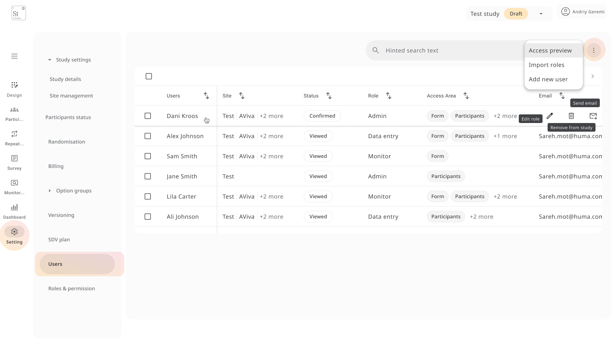

## Adding Users

1. Go to the **Users** section under **Users & Roles**
2. Click **Add new user**
3. Enter the following details:
   - Email address
   - Assigned role (*Admin*, *Monitor*, *Data Entry*, etc.)
   - Site(s) the user should have access to
4. Optionally, **import a list of users** from file

Each user will receive access to the selected areas upon invitation.

---

## User Roles

Each role comes with a defined set of **access rights**. Common roles include:

- **Admin** – Full access to study setup, randomisation, participant data, and exports
- **Monitor** – Can view data, queries, SDV, and participant status, but cannot modify forms
- **Data Entry** – Can add/edit participant data and submit forms, but limited access to settings

You can edit **role permissions** via **Roles & Permission**, including:

- Add/edit participant details
- Randomise participants
- Send/view surveys
- Sign and lock forms
- Resolve queries and perform SDV
- Export data

Each role lists its associated **permissions and access areas** (e.g., *Participants*, *Forms*, *Surveys*, *Settings*).

> 💡 **Best Practice Tip:**  
> To maintain clean access control:
> - Assign only necessary permissions to each user  
> - Use role templates for consistency across sites  
> - Regularly audit user lists during long studies