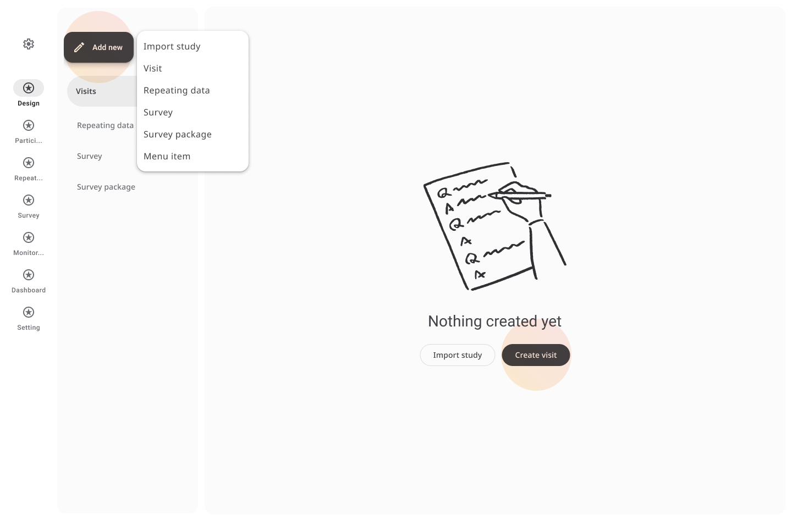
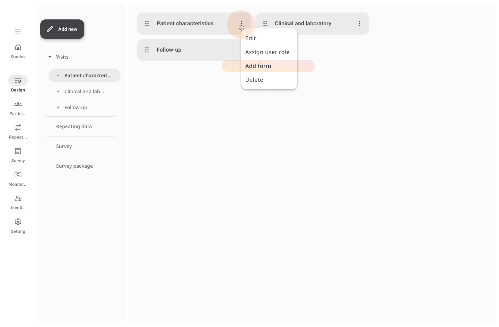

# Add Visits and Forms

Once your study is created, you can begin structuring its data collection by creating visits and assigning one or more forms to each visit.

---

## Creating a Visit

1. Navigate to the **Design** tab in your study.
2. Select **Add new > Visit** from the side menu or top bar.

3. In the **"Add a new visit"** window, complete the following:
   - **Visit name** – e.g., Baseline, Week 1, or Follow-up
   - **Visit number** – Numerical ordering of the visit (e.g., 1, 2, 3)
   - **Duration (in months)** – *(optional)* Used for planning visit intervals
4. Assign user roles for this visit if needed (e.g., **Admin**, **Monitor**, **Data-entry**).
5. Click **Add** to save the visit.

Once added, the visit appears in the left-hand list of your study structure.  
You can add multiple visits, and each visit can contain one or more forms.

## Adding a Form

1. Click on the **⋮** (three dots) next to the visit you want to attach the form to.
2. Click **Add form** from the top or inline options.

3. Complete the following fields:
   - **Form name** – e.g., Demographics, Vitals, Medical History
   - **Description** – *(optional)* Text to describe the form’s purpose
   - **Select a visit** – Choose from the list of previously created visits
4. Click **Create** to begin editing the form.

