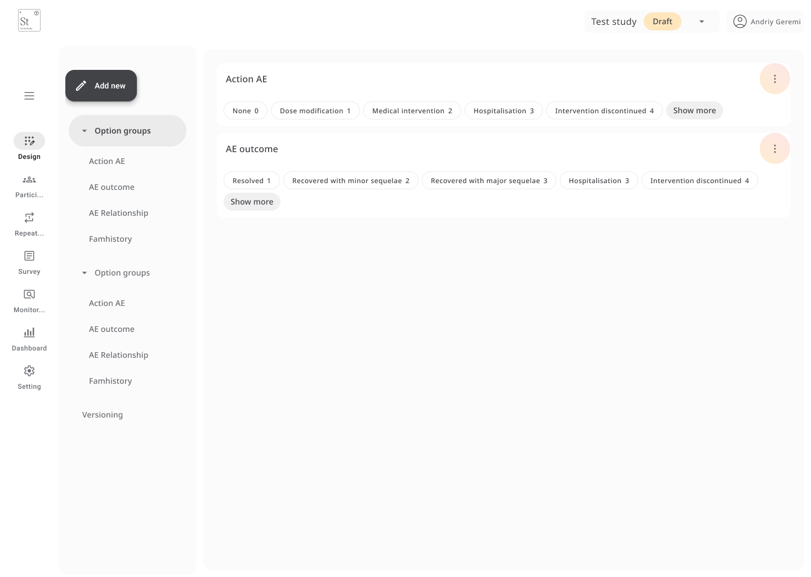

# Option Groups

**Option groups** allow you to define a reusable list of choices that can be applied across multiple form fields, such as dropdowns or radio buttons.  
This helps ensure consistency in how responses are entered and simplifies form building, especially when the same set of options is used repeatedly  
(e.g., severity levels, country lists, or intervention types).

---

## Creating a New Option Group

1. Go to the **Design** tab and select **Option groups** from the side menu.
2. Click **Create option group**.
3. Enter a group name (e.g., *Adverse Event Actions* or *Dose Modifications*).
4. Add items to the group by filling in:
   - **Name** – the label that appears in the form (e.g., *Hospitalisation*)
   - **Value** – the internal value stored in the dataset (e.g., `2`)
5. Click **Add new** to include more items.
6. When you're done, click **Save**.

Once saved, the option group will be available in the form builder whenever you create a dropdown or radio button field.

---

## Editing an Existing Option Group

To make changes to an existing list:

1. Go to **Option groups**, select the group, and click the **⋮** on the top right.
2. Add, modify, or delete options as needed.
3. Click **Save** to apply your changes.

> ⚠️ Updates to option groups will apply **anywhere they’re used**, so proceed with care if the forms are already in use.

---

## Use Cases

Common examples where option groups are helpful:

- Adverse event actions (e.g., *None*, *Medical intervention*, *Hospitalisation*)
- Dose modification types
- Yes / No / Unknown responses
- Country or region lists
