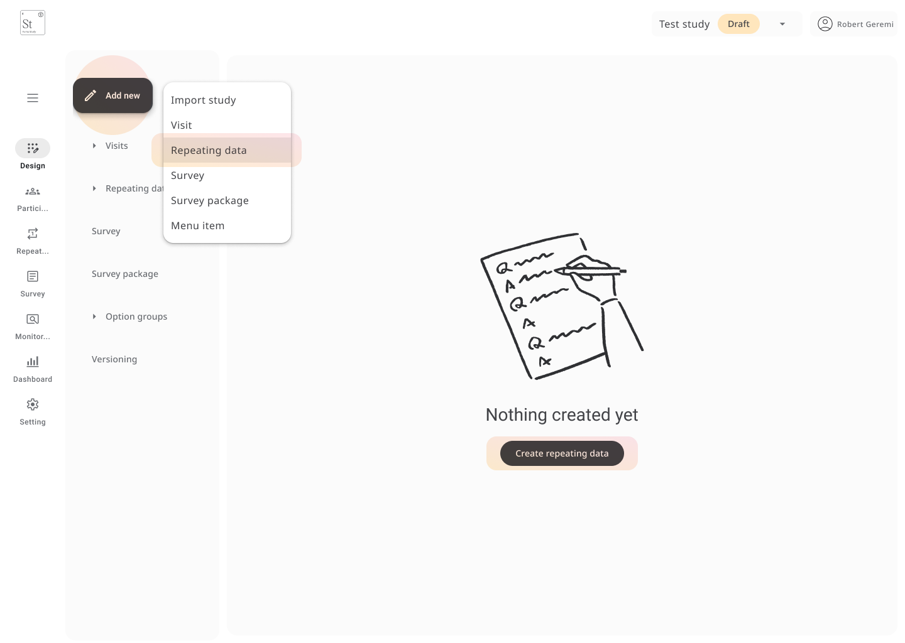

#  Repeating Data

**Repeating data** allows you to collect multiple instances of the same form for a participant across a study.  
This is useful when the number of events or entries varies by participant — for example:  
medication intake, adverse events, or unscheduled visits.

To create a repeating data group:

1. Go to the **Design** tab and select **Add new > Repeating data**.
2. Give the group a name (e.g., **Medication Intake**).
3. Choose a naming strategy:
   - Allow the system to auto-generate instance names, or
   - Let users name each entry manually.
4. Click **Create** to add it to your study structure.

After creating a repeating data group, click **Add form** to build a new form or connect an existing one.  
These forms function just like your standard data collection forms and can include logic rules, dropdowns, and validation checks.

When filling out data, users can add the form as many times as needed for each participant.  
Each entry is saved separately with a timestamp, making it easy to track repeated events clearly and reliably.

#### You can use repeating data to:
- Record more than one adverse event
- Log repeated clinical results (like blood pressure readings)
- Track ongoing or changing medications
