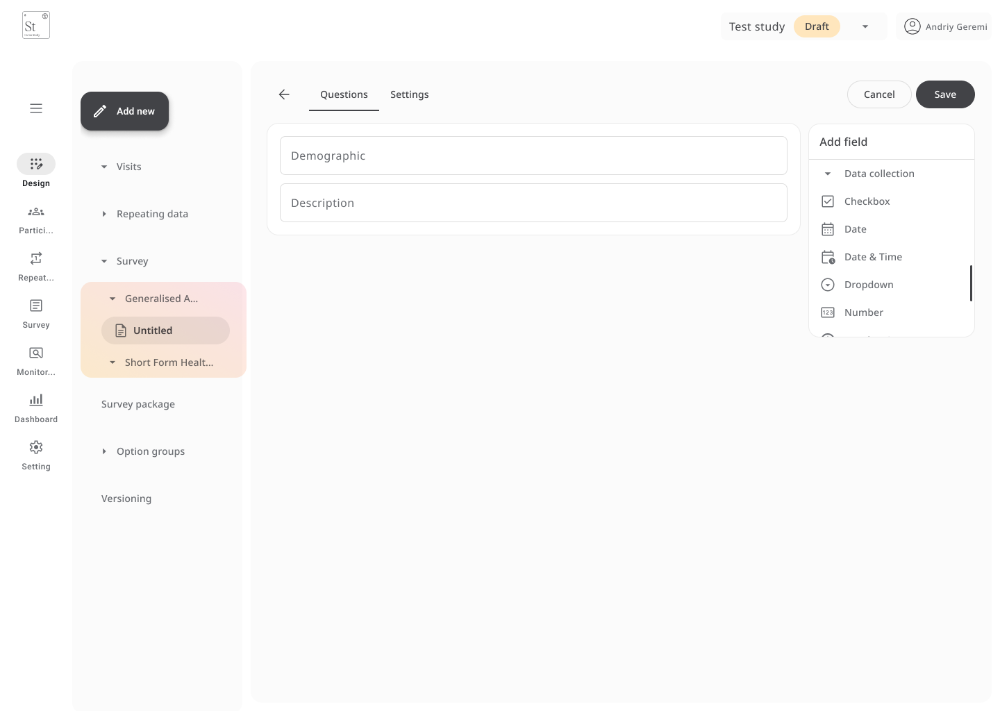

import SurveyImage from '../assets/survey-package.png'

# Surveys and Survey Packages

**Surveys** are used to collect data directly from participants, either once or on a schedule.  
You can build standalone surveys and then distribute them using **Survey Packages**, which support delivery logic, reminders, and custom messages.

---

## Creating a Survey

A survey is a set of one or more forms that participants complete independently of scheduled visits.

To create a new survey:

1. Go to the **Design** tab and click **Add New**.
2. Select **Survey** from the dropdown.
3. Fill in the **Survey name**, along with any optional fields:
   - **Introduction text** – Displayed when the participant opens the survey
   - **Outro text** – Shown after completion
   - **Footer text** – Appears at the bottom of intro/outro pages
4. Click **Add** to save.

After creating a survey, you can design it using the **form builder**, just like visit-based forms.  
Add questions, validations, and option groups as needed.

---

## Creating a Survey Package

A **Survey Package** combines one or more surveys and defines how and when they will be sent.

1. After clicking **Add New**, go to **Survey package** and click **Create Survey Package**.
2. Complete the following fields:
   - **Package name**
   - **Introduction text** (shown before the survey starts)
   - Optionally enable **Lock survey if finished**, to prevent edits

3. Set up the **invitation email**:
   - Choose sender details
   - Add subject and custom message using `{url}` for the survey link and `{logo}` for branding

 

4. Configure survey behavior:
   - Enable a navigation bar across forms
   - Require completion of all mandatory fields before continuing
   - Allow creation of an **open survey link** (e.g., QR or shareable URL)
   - Set a **finished URL** if you want to redirect participants after submission

5. Click **Next** to continue.

---

## Managing Surveys

Once created, surveys and packages will appear in the **left-hand navigation**. From there, you can:

- **Edit** text or settings
- **Duplicate** for reuse
- **Print** for offline review
- **Delete** if no longer needed

---

> 💡 **Tip:**  
> Use **Survey Packages** when you want to control timing, messaging, and tracking across multiple surveys.  
> Use **Surveys** alone for quick, ad hoc participant data collection.
