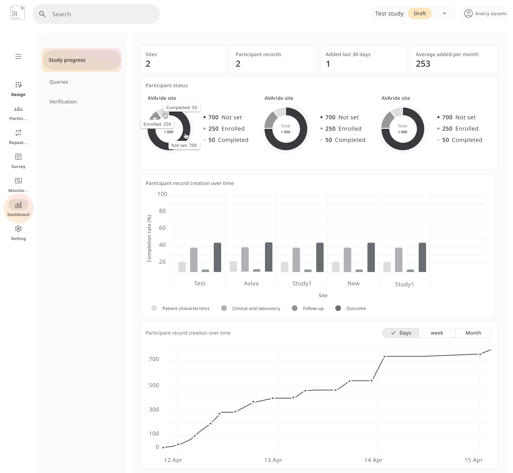
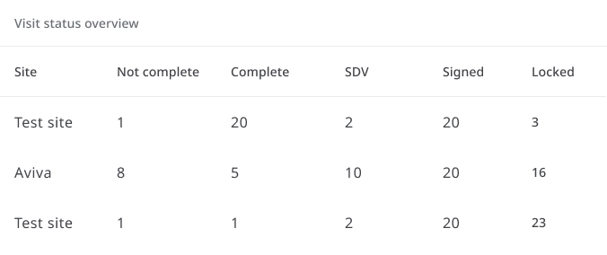
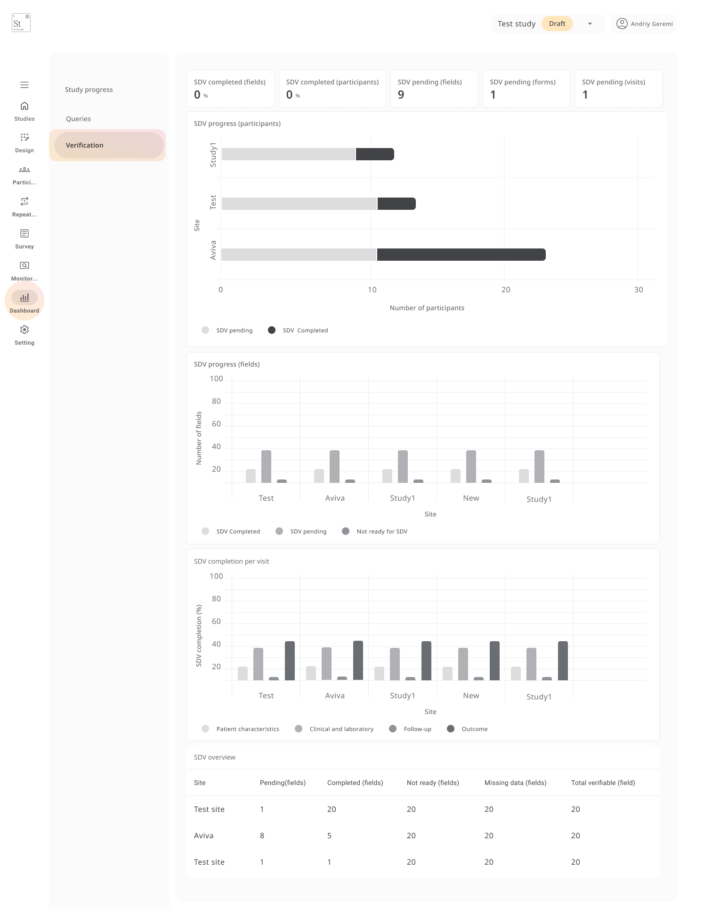
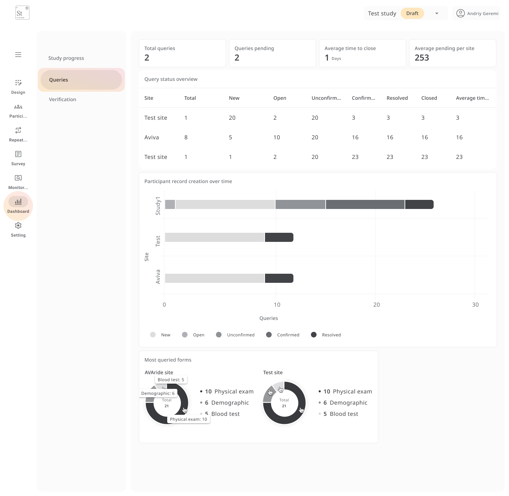

# Study Metrics (Dashboard)

---

## Study Progress

The **Study Metrics** provides an at-a-glance overview of study performance, allowing you to monitor key indicators such as:

- Participant enrolment
- Visit completion
- SDV progress
- Query status across all sites

This view is especially useful for **study coordinators**, **monitors**, and **sponsors** who need a high-level view of operational progress.

---

##  Participant Overview

The **Participant** section summarizes:

- Total participants across all sites
- Status breakdown: *Not set*, *Enrolled*, *Completed*
- Trends over time for participant creation and activity

You can **filter the charts** by day, week, or month to track how recruitment is progressing.

---

##  Visit Status Overview

This section displays **visit-level data by site**, including:

- Number of **completed** and **not completed** visits
- Number of visits that are **Signed**, **Locked**, or **Source Verified (SDV)**

These insights help monitor **site compliance** and identify locations that may need follow-up.

---

##  SDV Completion

Track **Source Data Verification (SDV)** progress at multiple levels:

- By **field**, **visit**, or **repeating data**
- Statuses: *Completed*, *Pending*, or *Not ready for SDV*
- Site-specific breakdowns available

Use this section to ensure SDV is being applied **consistently** across the study and to identify areas requiring attention.

---

## Query Summary

This section displays key query metrics:

- Total number of queries
- Queries pending resolution
- Average time to close a query (in days)
- Breakdown by site and query status:
  - *New*
  - *Open*
  - *Confirmed*
  - *Resolved*
  - *Closed*

You can also identify the **most queried forms**, such as *Physical Exam*, *Demographics*, or *Blood Test*.  
This helps surface data entry patterns that may require clarification or additional training.

---

The **Dashboard** helps study teams stay aligned by consolidating operational metrics in one place, supporting faster decisions and better oversight.
