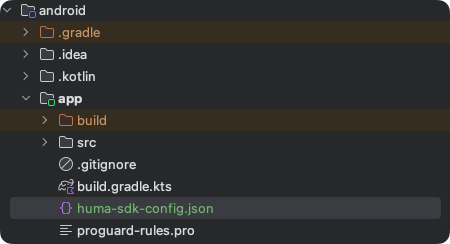

# Quick Start Guide Android

## Minimal Requirements for SDK setup.

1. **Add the Huma SDK Maven repository to your project**: Open your `settings.gradle.kts` file and
   add the following code to the `dependencyResolutionManagement` section:

```kotlin
maven {
    // TODO: wil be replaced with the actual public url
    url = uri("https://maven.pkg.github.com/huma-engineering/huma-android-sdk")
    credentials {
        username = "***"
        password = "***"
    }
}
```

Note: Replace *** with your GitHub username and GitHub token.

2. **Add the Huma SDK dependency to your project**: Open your `build.gradle.kts` file and add the
   following code to the `dependencies` section:

```kotlin
dependencies {
    // Other dependencies...

    // Install complete SDK bundle 
    implementation("com.huma.sdk:bundle:2.x.x")

    // Or install individual modules 
    implementation(platform("com.huma:android-sdk-bom:2.x.x"))
    implementation("com.huma.sdk:appkit")

    /* Plugin dependencies */
    // Replace with the actual Plugin modules
    implementation("com.huma.sdk:plugins-...")
    // Replace with the actual Plugin device module
    implementation("com.huma.sdk:plugin-device...")
    // Replace with the actual Plugin Huma module
    implementation("com.huma.sdk:plugin-module...")
    // Replace with the actual Plugin widget module
    implementation("com.huma.sdk:plugin-widget...")
}
```

3. Add Huma gradle plugin to your project:

```kotlin
plugins {
    id("com.huma.sdk.gradle-plugin") version "1.0.0"
}
```

4. Download the `huma-sdk-config.json` file from the Builder portal and add it to your project's app
   folder.



5. Initialize Huma SDK in your Application class or
   using [AppStartup library](https://developer.android.com/topic/libraries/app-startup):

```kotlin
context.installHumaSdk()
```

6. To get started with you screen, you can use the following code:

```kotlin
val humaAppKitManager = HumaAppKitManager.getInstance(context)
val screen = humaAppKitManager.findScreen("screenId")
```

After this steps you can start using Huma SDK in your project. To get more information about the
configuration options please refer to the [Getting Started](../sdk/%2FGetting%20Started/Android.mdx)
section.

