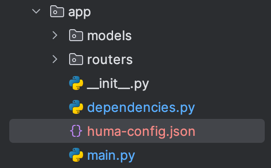

# Quick Start: Backend integration

## Overview

This guide provides step-by-step instructions to integrate our product into your system.

### Prerequisites

- Access to Huma Admin Portal.
- Installed [Huma Python Client](https://github.com/huma-engineering/huma-python-client)
- Huma Android/iOS SDK integrated in your project.

### Steps to Integrate

#### 1. Obtain and Configure API Domain and Client Details

1. Log in to the [Huma Portal](https://your-cloud-portal-url.com).
2. Navigate to the **API Keys** section.
3. Download the `huma-config.json` configuration file with secrets provided for your integration.
4. Copy the `huma-config.json` to your project directory.



5. Install python client

```bash
pip install huma_python_client
```

#### 2. Initialize library

Basic initialization is pretty simple, just provide the path to your `huma-config.json`

```python
from huma_python_client import HumaApiClient

client = HumaApiClient(config_file="config.json")

# Register a new user
response = client.register("user@example.com", "FirstName", "LastName")
print(response)

# Login a user
response = client.login("user@example.com")
print(response)
```

### Endpoint Implementation Example

User authentication should be handled via your original endpoints. The "Get Huma Token" endpoint (for example: `{domain}/private/huma-token`) should be protected and based on the current authenticated user, perform the requests to Huma backend.

To implement the `private/huma-token` endpoint:

1. Attempt to sign in the user using the `client.login()` method.
2. If the user does not exist (returns a 403 status), sign them up using the `client.register()` method.
3. Return the tokens and user ID (uid) received from the Huma backend.

The following example demonstrates how to implement the `private/huma-token` endpoint.

```py
from fastapi import APIRouter, Depends
from huma_python_client.client import HumaApiClient
from huma_python_client.exceptions import UserDoesNotExistError as HumaUserNotExistError

from app.dependencies import authenticate
from app.models.database import User
from app.models.responses import HumaTokenResponse
from app.models.user import HumaTokenRequestBody

router = APIRouter(prefix="/private", dependencies=[Depends(authenticate)], tags=['Huma'])


@router.get("/huma-token")
def get_huma_token(request_body: HumaTokenRequestBody = Depends(), current_user: User = Depends(authenticate)) -> HumaTokenResponse:
    """
    Interacts with Huma backend to auth the user and provide the auth and refresh tokens for Huma sdk.
    """
    huma_client = HumaApiClient(config_file="huma-config.json")
    try:
        rsp_json = huma_client.login(current_user.email, request_body.client_type)
    except HumaUserNotExistError:
        rsp_json = huma_client.register(current_user.email, current_user.firstName, current_user.lastName, request_body.client_type)
    return HumaTokenResponse(**rsp_json)
```

### Conclusion

By following these steps, you can integrate our product seamlessly into your system. If you have any questions or need further assistance, please contact our support team.
