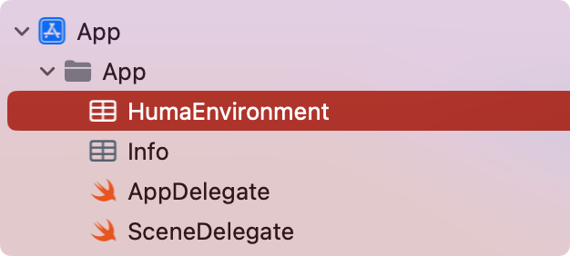

# Quick start: iOS

1.	Define the spec sources and add Huma dependencies and post_install in your Podfile:
   ```ruby
    source 'https://github.com/CocoaPods/Specs.git'
    source 'git@github.com:huma-engineering/huma-ios-specs.git'

    pod 'HumaAppKit'
    pod 'HumaHeaderWidget'
    pod 'HumaVitalWidget'
    pod 'HumaRealmPlugin' # in a short future, we will remove the need to add this pod

    # in a short future, we will remove the need to add post_install
    # currently, it's needed due to a 3rd-party dependency (FlagPhoneNumber)
    post_install do |installer|
        installer.pods_project.build_configurations.each do |config|
            installer.pods_project.targets.each do |target|
                target.build_configurations.each do |config|
                    config.build_settings['IPHONEOS_DEPLOYMENT_TARGET'] = '15.0' # or your minimum deployment target
                end
            end
        end
    end
   ```

2. Download the `HumaEnvironment.plist` file from the Builder portal and add it to your project's app folder.

    

3.	Import the Huma SDK in AppDelegate.swift:
    ```swift
    import UIKit
    import HumaFoundation
    import HumaAppKit
    ```
4.  Implement AnyHumaAuthProvider protocol:
    ```swift
    extension APIClient: AnyHumaAuthProvider {
        static var initialAuthData: AuthData? {
            guard let response = shared.humaTokenResponse else { return nil }
            
            return AuthData(
                userID: response.uid,
                refreshToken: response.refreshToken,
                refreshTokenExpiresIn: response.refreshTokenExpiresIn,
                authToken: response.authToken,
                authTokenExpiresIn: response.authTokenExpiresIn
            )
        }
    }
    ```
5.	Initialize the SDK in in the application(_:didFinishLaunchingWithOptions:) method:
    ```swift
    HumaApp.initialize()
    ```
6.	Present the screen from SDK in your view controller code:
    ```swift
    self.token = HumaApp.presentWidgetScreen(withID: "ScreenID", from: self)
    ```
7.  Remember to end user session on log out:
    ```swift
    HumaApp.endUserSession()
    ```