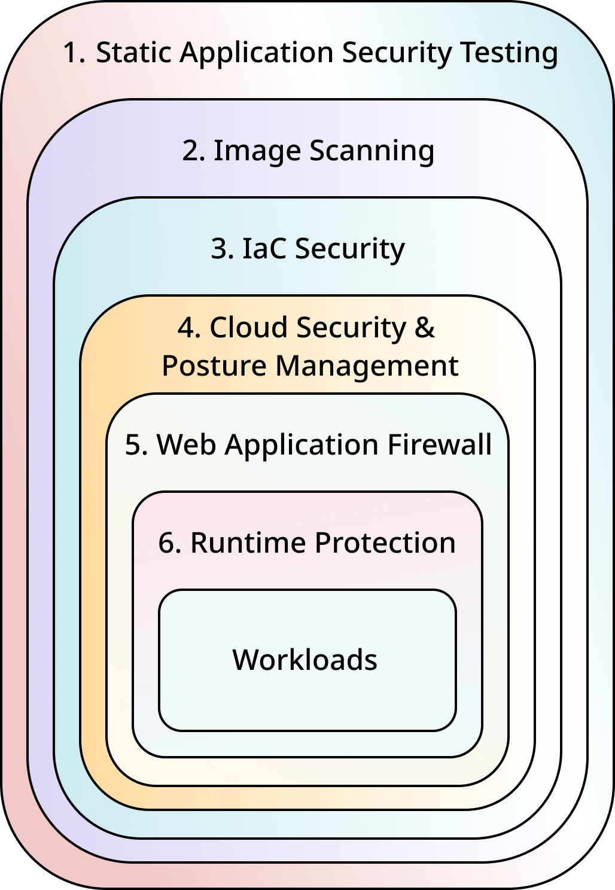

<table style={{ border: 0 }}>
<tr style={{ border: 0 }}>
<td style={{ width: "63%" , border:0 }}>

We deploy multiple layers of protection to protect the workloads in our clusters: 

1. The code that forms our backend goes through Static Application Security Testing (SAST) in our CI/CD pipeline. This shift-left approach empowers our developers to tackle security and quality issues before the code is packaged.

2. Further down the pipeline, before images are published to the container registry, the build image is scanned once more to identify vulnerabilities at the image level.

3. We use Terraform as our IaC tool and to ensure we are provisioning a secure and compliant infrastructure, our IaC code is scanned as part of our CI/CD to identify any msiconfigurations or non-conformities against common standards (ISO27001, GDPR, ...), before the infrastructure is provisioned.

4. Any infrastructure misconfigurations not captured up to this point will be identified as part of our Cloud Security & Posture Management (CSPM) solution
Our clusters are protected by Wallarm Web Application Firewall (WAF). This will prevent and block potential attacks targetting our API endpoints.

5. While we had two layers of testing/scanning as part of our CI/CD (item 1 and 2), we also utilise Runtime protection agents that monitor the workloads in our clusters to identify any malicious behaviour.

</td>
<td style={{ width: "36%" , border: 0 }}>

</td>
</tr>
</table>